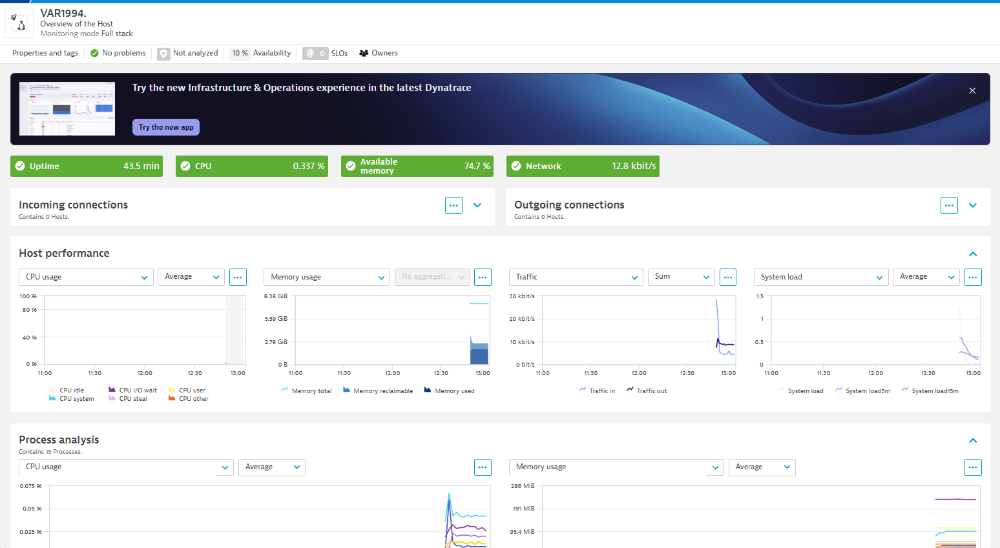

# Taller 1: OneAgent con Microservicio Python

## Objetivo
Instalar Dynatrace OneAgent y ejecutar un microservicio Python, validar la visibilidad del servicio desde Dynatrace.

## Requisitos
- Cuenta activa en Dynatrace (SaaS).
- Token de instalación de OneAgent (acceso API).
- Docker instalado.

## Preparación
1. Clona o descarga los archivos de este taller.
2. Reemplaza `DT_API_URL` y `DT_TOKEN` con tus datos reales de Dynatrace.
(Puedes usar todo en Windows o todo en Linux/WSL)

En la web de Dynatrace encontrarás la manera de instalar OneAgent en tu máquina:

En tu página de instalación (semejante a https://hwi36700.apps.dynatrace.com/ui/apps/dynatrace.discovery.coverage/install/oneagent) copia los comandos:


wget -O Dynatrace-OneAgent-Linux-x86-1.313.45.20250521-164818.sh "https://xxxx4242.live.dynatrace.com/api/v1/deployment/installer/agent/unix/default/latest?arch=x86" --header="Authorization: Api-Token dt0c01.XXXXXX"

/bin/sh Dynatrace-OneAgent-Linux-x86-1.313.45.20250521-164818.sh --set-monitoring-mode=fullstack --set-app-log-content-access=true


## Archivos
- `app.py`: código fuente de microservicio Flask.
- `Dockerfile`: definición de imagen Docker.

## Pasos

### 1. Construir imagen Docker
```bash
docker build -t python-microservice .
```

### 2. Ejecutar contenedor
```bash
docker run -d -p 5000:5000 python-microservice
```

### 3. Validar en Dynatrace
- Verifica en Dynatrace: Hosts.classic que se detecta el contenedor.
- Observa trazas, logs y métricas.



Extra: Modifica la aplicación para generar más datos y genera dashboards si te ves capaz. 

CUANDO ACABES: Destruye dynatrace y destruye el contenedor
( sudo /opt/dynatrace/oneagent/agent/uninstall.sh
docker rm …)
