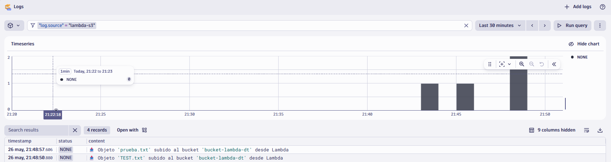

# Integración LocalStack + Lambda + Dynatrace (vía Logs)

## 📘 Descripción del proyecto

Este proyecto simula un entorno AWS local con **LocalStack** para ejecutar una función Lambda cuando se sube un archivo a un bucket S3. La Lambda genera un log enriquecido y lo envía a **Dynatrace** mediante su API de logs (`/api/v2/logs/ingest`).

Es una práctica orientada a demostrar cómo Dynatrace puede integrarse con flujos de eventos incluso en entornos simulados y sin acceso real a la nube.

---

## 🧠 Competencias de Dynatrace trabajadas

- **Observabilidad basada en eventos**
- **Ingesta de datos personalizados vía API**
- Uso del **Log Viewer** y **Davis Data Explorer**
- Comprensión de las limitaciones de ingestión de **métricas personalizadas**
- Aplicación de **token de API con permisos específicos**

---

## 🛠️ Componentes utilizados

- `LocalStack`: simula servicios AWS (S3, Lambda).
- `Terraform`: despliega recursos en LocalStack.
- `AWS CLI` / `awslocal`: para interactuar con servicios simulados.
- `Dynatrace API v2`: se usa `/logs/ingest` para enviar datos.
- `Python Lambda`: función que procesa eventos y envía logs.

---

## 📦 Estructura del repositorio

```
.
├── lambda/
│   └── handler.py                 # Código Lambda que envía logs a Dynatrace
├── lambda_function_payload.zip   # Paquete desplegado por Terraform
├── main.tf                       # Infraestructura (S3, Lambda, permisos)
├── terraform.tfvars              # Variables sensibles (token Dynatrace)
├── variables.tf                  # Definición de variables
└── README.md                     # Este archivo
```

---

## ▶️ Comandos utilizados

### 1. Iniciar LocalStack

```bash
docker compose up --build
```

### 2. Inicializar y aplicar Terraform

```bash
terraform init
terraform apply
```

### 3. Subir un archivo a S3

```bash
aws --endpoint-url=http://localhost:4566 s3 cp TUARCHIVO.txt s3://bucket-lambda-dt/
```

### 4. Verificar logs en LocalStack

```bash
docker logs localstack
```

---


## 🔍 Cómo visualizar los datos en Dynatrace

1. Entra a **Logs** en Dynatrace.
2. Usa filtros como:
   - `log.source = "lambda-s3"`
   - o busca contenido como `"bucket-lambda-dt"`

También puedes usar **Davis Data Explorer** con DQL:

```sql
fetch logs
| filter log.source == "lambda-s3"
| sort timestamp desc
```

---

## ✅ Resultado

Cada vez que se sube un archivo al bucket, se genera un log en Dynatrace como:




Este flujo permite observar el comportamiento del sistema sin necesidad de AWS real ni licencias adicionales.

---
